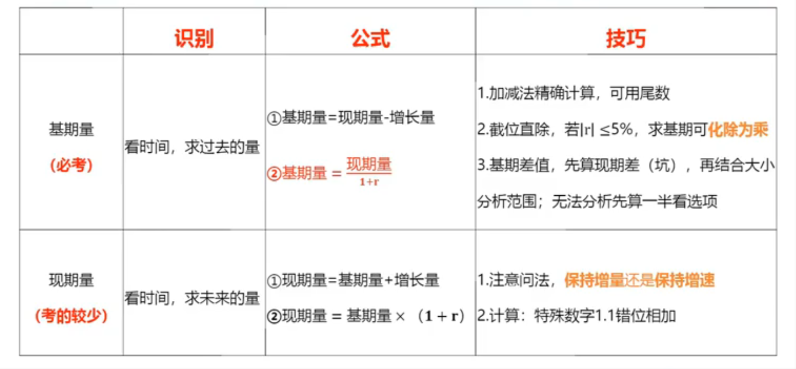
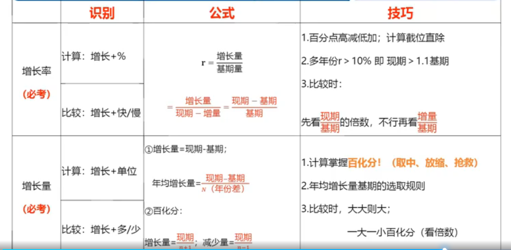
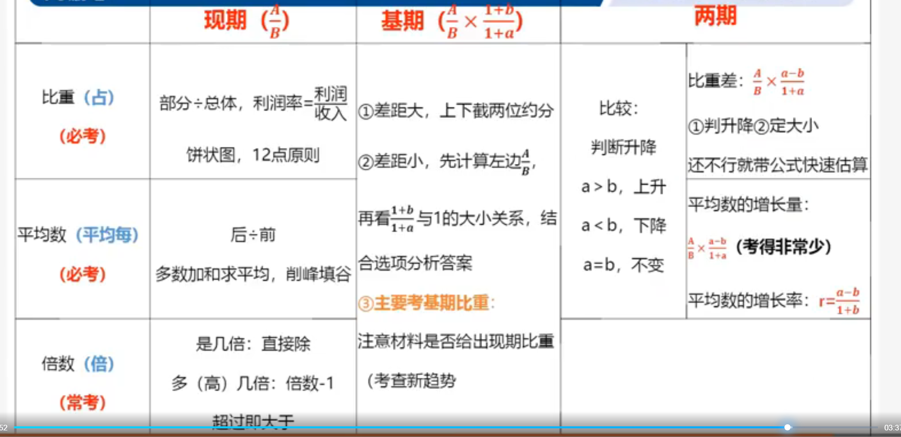
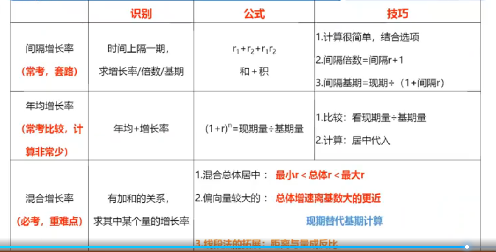

# 总结

1. 2019年保费收入占江苏省总保费收入**比重同比增加**的险种是

   **比重增加/下降 -> 两期比重升降（比较）**

2. 2020年，我国软件和西南技术服务业营业**利润率**比上年：

   A.上升了2个百分点以上

   **比重上升/下降+百分点 -> 两期比重计算**

3. 2021年上半年，我国集成电路出口平均价格同比有所提高

   **平均+高/低 -> 两期平均比较**

4. 2016年全社会餐饮业平均每个经营单位的从业人数比上年约

   A.减少了2%

   B.减少了15%

   C.增加了2%

   D.增加了15%

   **平均每+上升+% -> 平均数的增长率**

