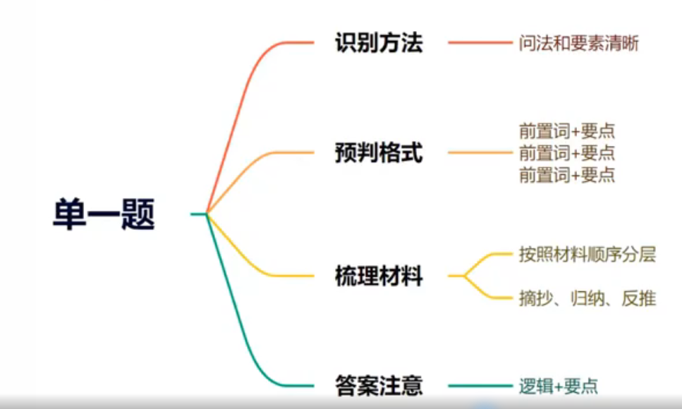

# 申论

申论考察考生是否具备从事国家机关工作的基本能力

## 申论能力考察

### 申论考试大纲(以国考副省级为例)

阅读理解能力--全面把握给定资料的相关内容，准确理解给定资料的含义，准确提炼事实所包含的观点，并揭示所反映的本质问题

综合分析能力--对给定资料的全部或部分的内容、观点或问题进行分析和归纳，多角度地思考资料内容，作出合理的推断或评价。

提出和解决问题能力--准确理解把握给定资料所反映的问题提出解决问题的措施或办法

文字表达能力--熟练使用指定的语种，运用说明、陈述、议论等方式，准确规范、简明畅达地表述思想观点

## 分析资料

### 要点挖掘技巧

#### 摘抄

1. 有人出来说话（政府官员、专家学者、记者、百姓）
2. 有转折、并列等关联词
3. 有：“”等标点符号
4. 有规范表达、高频表达

#### 概括归纳

1. 啰嗦的材料，多为案例
2. 不直接的材料，多为数据

#### 反推

答非所问，例如对策推问题，国外推国内

## 单一题基础理论

### 识别

题干中作答要素明确且相对较少的题目。

要素即为题干中明确指出的作答任务，如:问题、对策、意义、变化、特点等。

### 答案结构

单一题的答案结构相对简单明了。

1. 外在形式上体现为答案分条列点，常见的方法是1、2、3或①、②、③或一、二、三。
2. 内在逻辑上要确保每条要点话题一致，在要点之间内容无交叉重叠;同时为了更好的体现答案逻辑，建议每条要点都加上总括性信息。

## 题型常见要素识别及答题技巧

### 问题题型

**常见问法**：问题、不足、困境、瓶颈、挑战、难点等。

### 思路

总（是什么、含义或者态度） → 分 → 总（怎么办？简要对策总结）

### 答案来源

①直接摘抄
  
  寻找负面的标志性词汇：不科学、不合理、不到位、不均衡、不完善、不健全、不足;缺乏、缺少、流失;少、低、差、弱、陈、单一等

②归纳概括：对案例型材料、数据型材料等进行精准归纳概括。

③分析推导：对建议型表达或对比型材料进行分析推导

### 影响题型

从时间上看：影响通常发生在主题后

影响大致可以分成正面影响和负面影响两类。在近年申论考试中，影响类题目出现频次更多的为“意义”。

①正面影响的常见问法:意义、效果、成果、积极作用等。

②负面影响的常见问法:危害、后果等。

### 答案来源

(1)正面影响

①直接摘抄:激发、促进、实现、提升、倒逼.;有利于、有助于、感动着、推动了、巩固了...

- 直接摘抄
- 解决问题(材料里只有问题没有意义)
- 实现目的(材料里只有目的没有意义)
- 对策分不清时写上

②通过问题进行推导:材料中想通过某项举措去解决问题，或者问题已经被措施解决了，可以将问题推导为意义。

③通过目的进行推导:材料中出现表示目的或目标的信息时，可推到为意义

## 对策题型

#### 常见问法

表对策的常见词汇：对策、措施、举措、建议、意见、做法、解决方法、经验、启示等

#### 答题技巧

摘抄或归纳总结

资料中出现表对策的标志性动词时，往往有得分点，可直接摘抄资料中已有的对策。

常见的动词有:建立、健全、统筹、创新、规范、整顿、打击、扶持、规划、设置等。

## 综合题型

### 词句理解

**识别**：谈的…含义；对…进行解释；谈对…的理解

**答题思路**

1. 内涵：可理解为定义，就近原则
2. 外延：分析相关要素:如问题、原因、意义、危害等
3. 解决：材料有则摘抄;材料没有根据答题格子处理

**答题逻辑VS材料逻辑**

划线词语出现的位置

1. 开头--正序
2. 中间--乱序
3. 结尾--倒叙

## 观点现象

题型判断

1. 题干中出现：对..观点/现象的见解/看法/评小潮学长价/评析/认识
2. 要求中出现：观点明确、分析透彻、论证充分、有理有据、论据充实等

**答题思路和高分技巧**

提示：如果题干有抽象词汇材料也解释了，你就把解释放在观点前。

观点:根据材料确定是支持，反对还是辩证看待(客观、多写)支持的

理由:讲道理、举例子

对策:只是个补充，字数够就行，能抄就抄，不能超就反推。

## 公文题理论

### 题型识别

量词+文种

### 阅卷要求

**格式分**：标题、称谓(主送机关)、落款。

**内容分**：问题、危害、意义、对策等

**语言分**：通俗易懂、表达生动、有感染力、有号召力、态度诚恳、建议口吻等。

### 格式

#### 具体格式

##### 标题

(1)一般写法

发文机关+“关于”+事由+“的”+文种

例如：国务院关于坚决稳定市场物价的通知

(2)数学格式

标题要居中书写（不带书名号）

#### 称谓或主送机关

(1)称谓（对象为人物）

例如：尊敬的与会嘉宾、广大家长朋友们等。

(2)主送机关（对象为单位）

例如：各社区、各街道办等。

(3)书写格式

顶格书写

#### 落款

(1)单位(个人)

例如:某企业工会(写在时间上一行)

(2)时间

例如:2022 年xx月xx日或者xxxx年xx月xx日

(3)书写格式

落款位于正文右下方，日期右空四个格子，发文者以日期为准上方居

#### 有无格式对应表

|              题目              | 标题 | 称谓 |     落款     |
| :----------------------------: | :--: | :--: | :----------: |
|    报告、通告、意见、通知等    |  有  |  有  |      有      |
|     倡议书、公开信、宣传稿     |  有  |  有  |      有      |
|   经验发言稿、事件处理发言稿   |  有  |  有  | 根据格子确定 |
|      时评、网评、新闻稿等      |  有  |  无  |      无      |
|   调查问卷、活动方案、提纲等   |  有  |  无  |      无      |
| 明确要求不写公文格式的命题方式 |  无  |  无  |      无      |

## 分类

### 分类标准

根据身份、对象和目的意图的不同，公文在内容要点的侧重点、语言表达和书写格式等方面会略有不同，按不同目的意图，公文大致分为四类:方秦类、总结类、宣传类、评论类。

### 方案类

#### 识别

方案类公文主要是为某个或者某些对象能够更好地完成工作或任务而进行的规划，一般侧重对策、建议、具体做法。

#### 典型方案类公文

指导意见、建议、活动方法等

#### 写作框架

#### 例如

### 总结类

#### 识别

总结类公文的主要目的是把具体情况告知或汇报给某个或者某些对象(其中具体情况中的要素要根据给定资料来确定)。

#### 典型的总结类公文

汇报（提纲）、调查报告、简报、编者按等。

#### 例如

### 宣传类

#### 识别

宣传类公文的主要目的是通过说服或宣传某种特定内容等转变他人的认知、看法，增长知识，进而倡导被宣传对象采取某些行动或者措施。

#### 典型的宣传类公文

公开信、倡议书、宣传稿等

#### 框架

#### 例如

### 评论类

#### 识别

对某些现象或者观点进行评价

#### 典型的评论类公文

时评、评论文等

#### 框架

#### 例如

## 大作文

### 作文的评分

1. 题目中提到结合个人感受或者不拘泥于材料，此时要求要写资料以外的论据或者例子

   **观点来源于题干和材料**

   **找观点的方法第一步:剖析题干**

   **定位方向第二步:梳理材料，确定具体关键词**

2. 观点要符合资料，最少要有三个分论点，找到的分论点要放在明显的位置，例如标题、首段、各段首句

3. 论据要多使用材料之外的

### 写作流程

#### 剖析题干，梳理写作方向

1. 题干指向明确要素--阅卷一般按点给分

   例如:众筹:金钱之外的价值

2. 题干抽象模糊--阅卷一般侧重解释说明

   例如:不学礼，无以立

3. 题干指向多元且清晰---阅卷一般就以题干为分论点

   例如:科学，艺术、古文化是想象力源泉

4. 题于是一对矛盾--阅卷侧重于辩证关系

   例如:试谈有与无

#### 梳理资料，寻找关键词

资料阅读顺序优先级

必看：指定资料--小题未涉及资料

选看：主题与文章话题一致的已用资料（阅读小题的题干及答案，看作文话题是否和小题话题完全一致）

### 文章结构

#### 大结构

1. 开头：开宗明义
2. 主体
    - 分论点1
    - 分论点2
    - 分论点3
    - 分论点4
3. 结尾：扣题升华

#### 如何写好标题

好的标题应该起到画龙点晴的作用。一般而言，完整的标题应该包含文章的主题和主要写作角度，如《安全生产重在防患于未然》，其中“安全生产”为文章的主题，“防患于未然指明主要写作角度。

#### 常规性标题

把简政放权做实做好（把 xx 做实做好）

加强信用体系建设势在必行（ xx 势在必行）

夜间经济助力城市发展（ xx 助力 xx ）

#### 比喻式标题

政务公开进入“快车道”

绘好科技创新的”工笔画“

家教是孩子最好的“营养剂”

#### 警醒式标题

莫让诗词“热”一时

新闻，不要以伤害为代价

文化艺术，勿以传统反现代

#### 对称式标题

**注意：可用于AB类型的多主体**

开放文化资源 促进共享传承

良法殷殷嘱托 行者莫忘善治

激发内生动力 推动可持续发展

#### 主副式标题

**注意：破折号占两格**

平衡

- 幸福生活需处理好“快”与“慢”的关系

试谈“有”与“无”

- 城市建设理念的辩证法

不患寡而患不均

- 扶贫工作要注重公平

#### 补充

经济:引擎、马车、助燃剂、换挡、弯道、烟火气

社会治理:组合拳、同心圆、温情、“大脑”、“聪明”

文化:源泉、沃土、根、生命力、“入海口”、精神家园

民生:晴雨表、传声筒、赶考、答好“试卷”、短板、一纸空文

生态:红线、安全线、绿水青山、钱袋子、新画卷、新境界

#### 如何写好开头

文章开头的作用是突出文章主题，引出观点。文章开头大致可以分解为几个部分:背景铺垫、引出主题，阐释或简要论述主题引出文章后续观点。

文章开头可以是一个段落，也可根据实际的情况拆分成两个段落

#### 开头结构总结

总字数:150字左右—3句话

引出(正反対比、背景、总结、名言) + 中心论点

解释(解释给定的话题、句子) + 中心论点

#### 论证结构与方法

##### 论证结构

论证是阐述自己的观点后，通过举例子、讲道理等手段对观点加以证明，使观点获得支撑的过程，即“论证=观点+论据”

##### 论证的形态

论证是多种论证方法的组合，一般来说，一个论证段可以同时包括多种论据形态。常见的论证形态有以下几种。

**观点+举例论证+道理论证+总结**

**特别声明**
**图片丢失，后续复习到此添加**

**观点+引用名言+对比论证+总结**
**特别声明**
**图片丢失，后续复习到此添加**

**观点+引用论证+排比论证+总结**
**特别声明**
**图片丢失，后续复习到此添加**

##### 论证段落

论证段:200字左右，4句话

分论点4解释+引用/案例/道理/对比/排比+扣题

1. 例子:五位一体
2. 名言:五位一体，古语、俗语
3. 句式:对比、排比

##### 结尾

文章结尾的作用就是收束全文，体现出文章结构的紧凑、完整，回扣、突出文章的主题。篇幅不宜过长，语言要干脆有力富有总结性或鼓舞性。

###### 总结式

    特别声明：图片丢失，后续复习到此添加

###### 展望式

    特别声明：图片丢失，后续复习到此添加

###### 呼吁式号召

    特别声明：图片丢失，后续复习到此添加

##### 写作结构

**标题**：先找关键词，再用常规/比喻/警示/对称/主副等方法

**开头**：解释/引出(背景、对比、举例、名言等)+点题

**论证段**：分论点+解释+引用/案例/道理/对比/排比+扣题

**结尾**：扣题+展望/总结/呼吁