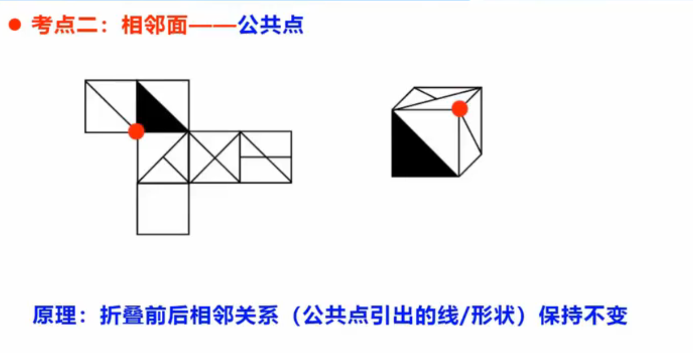

# 图形推理

## 位置规律

**图形特征：元素组成基本相同**

### 考点1：平移

**做题方法**：就近假设（标序号）

#### 多宫格方向判定

**看中间，判方向**

**注意：图形明显分部分（上下、左右、内外），要分开找规律**

#### 走重合判定

1. 题干中和选项绝大数图形块数相同
2. 走重合的时候，块数最少的图形一般不在第一幅图

### 考点2 旋转、反转

1. 左右翻转：竖轴堆成
2. 上下翻转：横轴堆成

### 位置规律总结

## 样式规律

1. 遍历
2. 加减同异（相同线条重复出现）
3. 黑白运算（黑白块）
4.

**注意：当某一个面特别大的时候，考虑最大最小面**

**注意**：特殊面是非中心对称的面

**多个选项有一个相同的特殊面，可以考虑画边法**

