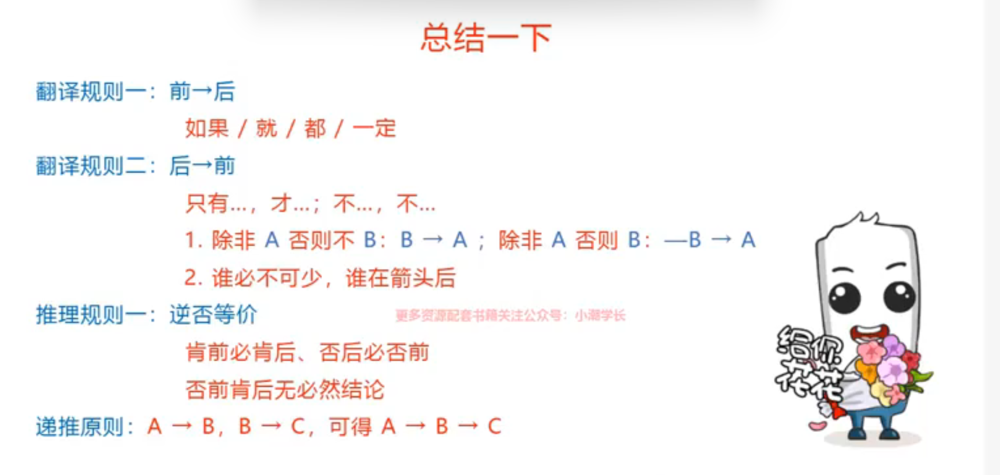

# 翻译推理

特征：题干和选项中存在明显的逻辑关联词

提问方式：可以推出/不能推出

解题思维

1. 先翻译（题干要翻译，选项要翻译）
2. 在推理

## 前 → 后

<strong style="color:yellowgreen">遇到必须在句子中间，相当于一定，前推后</strong>

### 等价关联词

1. 若…，则…

2. 只要…，就…

3. 所有…，都…

4. 为了…，一定…

5. …是…的充分条件

6. 如果…，就…

## 逆否等价

### 符号表示

A → B = !B → !A

### 文字表示

1. 肯前必肯后，否后必否前（前 → 后，!后 → !前）
2. 否前肯后没有结论（!前 || 后 → null）

## 串联

若A → B，B → C，则A → B → C

## 后→前

<strong style="color:yellowgreen">遇到“才”，后推前</strong>

### 等价关联词

1. 只有…，才…

2. 不…不…

    - 不A → 不B（带着“不”直接翻译） -> 这种情况是**前推后**

    - B → A（不带“不”，否后得出否前） -> 最常用

3. 除非…，否则不…

    - <strong style="color:yellowgreen">除非A，否则不B：B → A</strong>

    - <strong style="color:yellowgreen">除非A，否则B：!B → A</strong>

4. …是…的基础/假设/前提/关键/必要/必不可少条件

5. 基础/前提/关键；不可缺少/必不可少；必要条件

   **注意**：谁必不可少，谁箭头后

## 必要条件和充分条件

<strong style="color:yellowgreen">谁充分，谁在箭头前；谁必要，谁在箭头后</strong>

例如：

1. 请客吃饭的充分条件是上岸 -> 上岸 → 请客吃饭

2. 行测80分的必要条件是每天都学习 -> 每天都学习 → 行测80分

## 总结

## 且和或

### A且B

<strong style="color:yellowgreen">二者同时成立</strong>

#### 等价关键词

1. 和
2. 既…又…
3. 不仅…而且…
4. …但是…

### A或B

<strong style="color:yellowgreen">二者至少一个成立</strong>

#### 等价关键词

1. 或者
2. 或者…或者…
3. 至少一个

**或的翻译**：或的关系为真，否定一项可以得到另一项（!1→1）

例如：不读书或看电视 -> 读书 → 看电视

## 德摩根定律

<strong style="color:yellowgreen">!（非）进去，&&（且） ||（或） 互变</strong>

1. !( A && B )  =  !A || !B
2. !( A || B ) =  !A && !B

例如：

1. !(方便面 && 大盘鸡) = !方便面 || !大盘鸡
2. !(数量难 || 判断难) = !数量难 && !判断难

## 组合排列

### 题型特征

题干给出几组对象和相关信息，要求把对象和信息进行匹配

#### 排除法：读一句，排一句

使用场景：题干信息确定

1. 快速找到谁是谁
2. 快速定位谁不是谁

#### 代入法：假设选项正确，带入题干验证

使用场景

1. 题干条件有真有假
2. 提问方式为“补充/添加以下哪个条件”
3. 提问方式为”可能/不可能“

题干条件确定优先排除；题干条件不确定尝试带入

#### 最小信息假设法：假设最小信息是对的

使用场景：题干出现只对了一半的情况下，找到出现次数最少的那一条，假设是正确的

#### 推理起点

确定信息：题干中明确给出 谁 = 谁 或 谁 ≠ 谁 的信息

最大信息：题干中出现次数最多的信息

假设法：二选一 或 无确定信息、最大信息

**注意**：

1. 选项充分—常考排除
2. 选项不充分—常考起点推理

## 日常结论

题型特征：提问方式为“可以推出”、“无法推出”等（题干中无明显的逻辑关联词）

解题思维

1. 不选：逻辑错误、无中生有、偷换概念
2. 慎选：比较关系、绝对化表达、程度词
3. 优选：从弱原则

## 逻辑论证

加强题型：赞同

削弱题型：反对

论据 → 论证 → 论点

### 做题方法

1. 看清问法（削弱、加强/前提）
2. 找出题干的论点和论据
3. 根据论点和论据话题是否一致，预设可加强/削弱选项
4. 根据预设匹配选项，对比择优（整体 &gt; 强于 &gt; 部分）

### 找论点与论据

典型提示词：

论据常见形式：原因、数据、事例、实验或调查内容

论据提示词：由于、因为、鉴于、根据

论点提示词：所以、结论是、这表明/说明/意味着，由此推出，据此认为

### 削弱类

#### 提问方式

1. 若以下各项为真，最能质疑/反驳/削弱/反对上述论断的是？
2. 若以下各项为真，（最）不能质疑上述论断的是？

### 削弱之否定论点

选项特征：与论点表述的意思相反

**注意：专家/科学家不一定对，小报不一定错**

解题步骤：找出论点 → 预设答案 → 对比选项

文段特征：文段只有论点，无论据；文段的论点和论据话题一致

#### 新替旧常考削弱

1. 老当益壮：旧事物有问题，但离不开他
2. 容光焕发：旧事物也会与时俱进，兼具新功能

#### 做题方法

1. 只有论点或论据话题一致：优先考虑否论点
2. 注意论点中的程度、时间限定词
3. 注意力度的比较：整体 ＞ 部分；必然 ＞ 可能；越接近论点越好
4. 特殊论点形式：“新替旧”；论点为对策（判断对策是否可行/是否有效）

### 削弱之否否定论证（拆桥）

定义：说论点与论据之间没有必然联系

选项特征：包含论点和论据中的关键词，并否定论点和论据之间的必然关系

<strong style="color:yellowgreen">
   注意：如果选项中同时出现了否论点以及拆桥，要看题干中提问的是什么
<ul>
  <li>如果提问的是削弱观点或结论，选否论点  </li>
  <li>如果提问的是削弱论证，选拆桥  </li>
</ul>
</strong>

使用场景

1. 没有否论点的选项
2. 论点与论据话题不一致
3. 提问方式为削弱论证

#### 时髦拆桥

论据：某物质中的一些元素有效

论点：某物质有效

削弱：某物质内该元素含量极少/要吃极多

例如：

论据：苦瓜水提取物，可以降低II型糖尿病小鼠的高血糖

论点：II型糖尿病患者多吃苦瓜有助于降低血糖水平

选项：日常使用的苦瓜中，苦瓜水提取物含量极少

### 削弱之否定论据

**选项特征**：与论据表达的意思相反

**题型特征**

1. 题干中有双方互怼，经常采用否定论据来削弱
2. 题干有论据并且找不到否论点和拆桥

### 削弱之因果导致和他因削弱

**因果论证：论点中包含因果关系**

…是…的原因；

…导致/使得/有助于…；

…增加/降低/加强/减轻…;

这是由于…

例如：研究人员认为，“缺觉”是导致第二天没有精神的原因

**因果倒置：原因和结果说反了**

论点：1导致2

因果倒置削弱：2导致1

选项特征：因果同时出现且时间顺序颠倒

例如：

①落后导致挨打 因果倒置—挨打使得落后

②喝可乐让他胖了 因果倒置—胖子才喝可乐

**他因削弱**

本质：干扰因素—用于削弱论点原因与结果之间的唯一联系

特点：同一主体、同一时间、不同原因

承认结果，同一个主体、同时存在、两种及以上可能的原因。若论点是其中一个原因，则可以用另一种原因进行削弱

例如：喝可乐学习成绩好，不喝可乐学习成绩不好，倘若学习成绩好的人还补课了，则补课就会造成原论点削弱

### 特殊类型

思路：不用预设，选项可能有多种加强/削弱方法，结合排除

不能加强—排除加强选项，削弱与无关均可

不能削弱—排除削弱选项，加强与无关即可

### 加强类

解题思维

提问方式：支持/加强论点 — 补充论据

找论点 → 圈关键词 → 对应答案

提问方式：前提/假设

有论点、有论据 — 搭桥：找论点、论据 → 去同存异

有论点、无论据 — 必要条件：没它不行（常考**方式+目的**论点）

### 加强之补充论据

1. 解释说明：说明论点成立的原因 — 整体上解释
2. 举例支持：证明论点成立的例子 — 部分上证明
3. 解题步骤：分析论点论据关系/看提问方式 → 想出加强 → 对比选项

   ①只有论点或论点论据话题一致：优先考虑解释说明、举例子

   ②一定看清楚论点讨论的主体和话题是什么，避免被选项带跑

   ③注意论点和选项中出现的限定词（时间限定、程度限定）

   ④择优比较（越接近论点越好，选项中有论点的关键词）

**注意**

1. 只有论点或论据与论点话题一致的时候，优先考虑
2. 择优比较 — 必然 &gt; 可能；越接近论点越好
3. 择优比较—原因解释 &gt; 举例子；整体 &gt; 部分
4. <strong style="color:yellowgreen">研究表明可选，专家说的或者研究机构说的不可选</strong>

### 加强之搭桥（力度最强）

定义：说论点与论据之间有联系

特征：论点论据话题不一致

**注意：搭桥要从论据向论点**

提问方式：前提、假设、必要条件、加强论证时候，优先考虑搭桥

选项特征：同时包含论点和论据中的关键词，并肯定论点和论据之间的关系

解题思维：找论点→找论据→去同存异→对比选项

### 加强之必要条件

必要条件：选项为论点成立的必要条件（没他不行）

提问方式：前提、假设、必要条件，且无搭桥选项

### 特殊提问

解题思路：

不用预设，选项可能有多种加强/削弱方法，结合排除

不能加强—排除加强选项，削弱与无关均可

不能削弱—排除削弱选项，加强与无关均可

### 原因解释

题型特征：最能解释/不能解释上述现象；题干中存在看似矛盾的现象

解题思维

1. 找矛盾—转折词：但是、然而…
2. 给理由—能够解释矛盾双方

**注意：常考题型—不降反增/不增反降**
