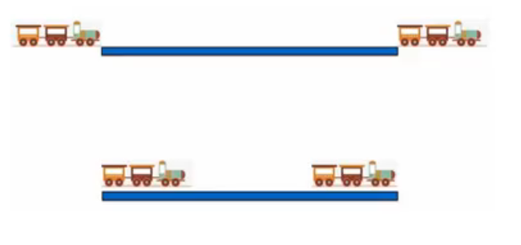
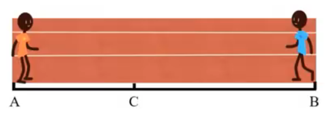
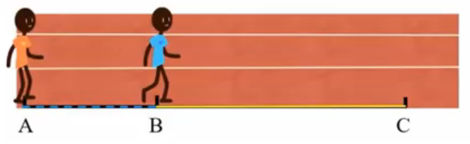
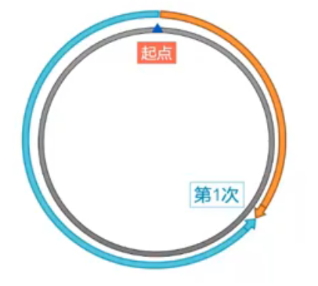
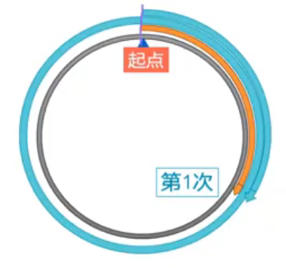
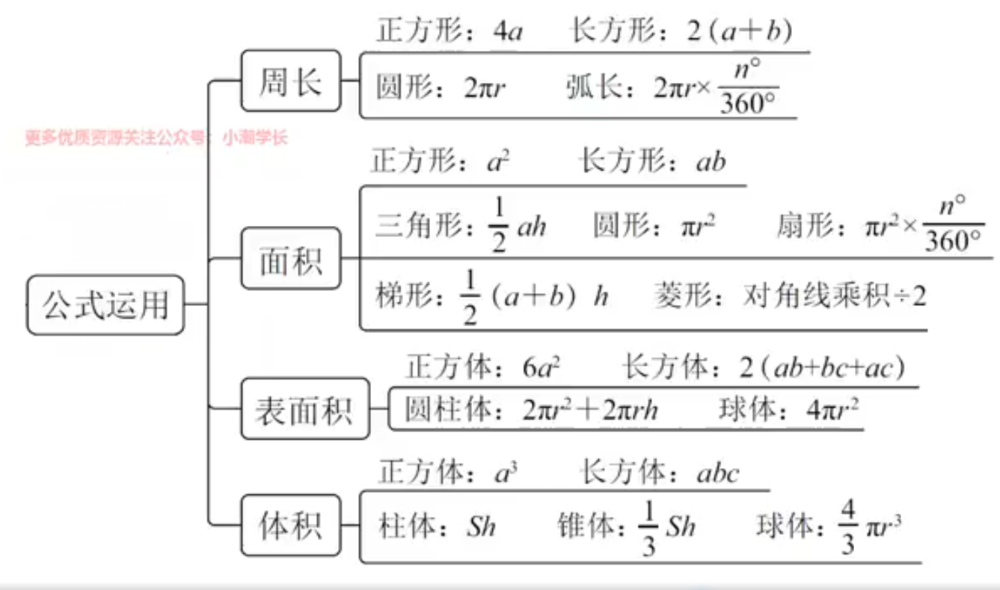
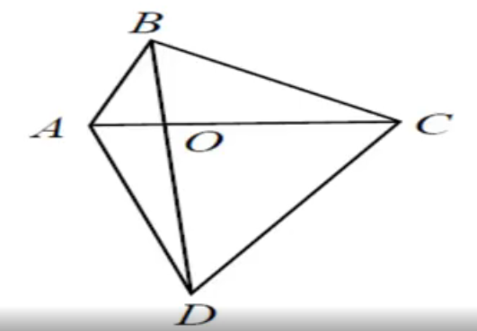
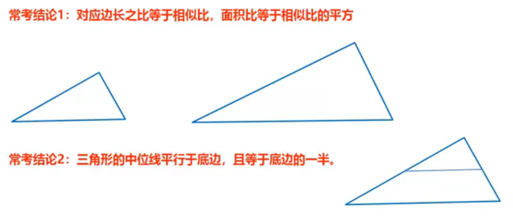
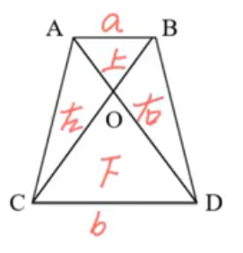

# 数量

就是考察数量关系的题目

## 代入排除法

特定题型

①多位数：涉及到位数变化，如”个位“、”百位“

例如：一个三位数，十位和个位对调，比原来大9，问这个三位数可能是多少？

②年龄：涉及到年龄的问题

例如：2021年，小明和小华年龄之和是20岁，小明比小华大两岁，小明2021的年龄是多少？

③不定方程：未知数个数多于方程个数

例如：3x+2y = 10，x、y均为正整数，求x、y的值

④余数：出现”剩“、”余“、”缺“等关键字，平均分组问题

例如：一个数，除以7余3，除以8余2，除以9余1，问这个数可能是多少

使用场景—看选项

选项信息充分：选项为一组数、可以转化为一组数

## 倍数特性法

### **基础知识**

#### 整除型

如果A=B×C（B、C均为整数），那么A能被B且能被C整除

题型：①平均分配（物品/人数） ②三量关系

#### 余数型

若$答案 = ax ± b$，那么答案∓b能被a整除（多退少补），a、x均为正数

例如：一堆苹果分给一些人，平均每人分十个还剩三个，问多少个苹果

#### 比例型

常见形式：题目中出现分数、百分数、比例、倍数，优先考虑比例型倍数特征

- 甲是乙的$\frac{3}{5}$（分数）
- 甲是乙的60%（百分数）
- 甲是乙的3:5（比例）
- 甲是乙的0.6倍（倍数）

- A占B的65% $\frac{A}{B}=\frac{13}{20}$

- C占D的78% $\frac{A}{B}=\frac{39}{50}$

- E占F多25% $\frac{E}{F}=\frac{1+25%}{1}=\frac{5}{4}$

- G占H少30% $\frac{G}{H}=\frac{1-30%}{1}=\frac{7}{10}$

已知$\frac{A}{B}=\frac{m}{n}$（m,n互为质数-没有公约数），则

1. A是m的倍数
2. B是n的倍数
3. A+B是m+n的倍数
4. A-B是m-n的倍数

## 方程法

### 普通方程

#### 设未知数技巧

设小不设大（减少分数计算）

设中间量（方便列式）

按比例设

问谁设谁

<strong style="color:yellowgreen">等差数列总和 = 中间项 × 个数</strong>

<strong style="color:yellowgreen">床位缺几个，就是人多几个，床位空几个，就是人少几个</strong>

#### 不定方程

方法：分析奇偶、倍数、尾数的数字特性，尝试代入排除

##### 奇偶

$ax+by=M$，当a、b恰好一个奇数一个偶数的时候，考虑奇偶特性（忽略偶数倍，剩下的部分奇偶性相同）

##### 倍数

$ax+by=M$，当a或b与M有公因子的时候，考虑倍数特性（by和M有**公因子G**，ax当中也必须有**公因子G**，如果a当中没有**公因子G**
，则必然是x有**公因子G**）

##### 尾数

$ax+by=M$，当a或b尾数是0或5的时候，考虑尾数特性

##### 代入

上述都使用不了，带入选项结合题干选出正确答案

## 工程问题

**三量关系**：$总量=效率×时间$

**注意：一定看清题干问的是单独还是共需**

<strong style="color:yellowgreen">工程常考陷阱：分几步工作的时候，问总时间要加上前面已经做了的</strong>

### 给效率或总量的具体单位型

1. 设未知数
2. 找等量关系列方程

### 给完工时间型

**注意：完工时间指的是完成同一项工程的多个时间**

1. 赋总值（一般设定为完工时间的公倍数）
2. 算效率：$效率=总量÷时间$
3. 根据工作过程列方程或式子

### 给效率比例型

1. 赋总值（满足比例即可）
2. 算总量：$总量=效率×时间$
3. 根据工作过程列方程或式子

#### 效率比例形式

- 直接给：甲：乙 = 3：4，甲的效率是乙的$\frac{3}{4}$
- 间接给

  ①工作量相等，效率和时间成**反比**

  甲4天的工作量等于乙3天的工作量

  ②时间相等，工作量与效率成**正比**

  相同的工作，当甲完成10%时，乙完成15%

- 给具体人数或机器数

  50个人去修路，30台机器收割麦子，则赋值每个人/每台机器效率为1

## 经济问题

### 基础经济

#### 公式

1. $利润= 售价-进价$
2. $利润率= 利润÷进价$
3. $售价=进价×（1+利润率）$
4. $折扣=折后价÷折前价$
5. $总价=单价×数量$
6. $总利润=单个利润×数量=总售价-总进价$

#### 方法

1. 方程法：有具体钱数、具体量
2. 赋值法

   ①给比例，求比例

   ②三量关系只知其一

操作方式：对条件和问题都没有给具体值的量进行赋值即可

### 分段计费

#### 题型判定

生活中水电费、出租车计费、税费等、每段计费不同，问不同收费标准下，共需要多少费用

#### 计算方法

1. 按标准，分开
2. 计算后，汇总

#### 函数最值

特征：单价和销量此消彼长，问何时总价/总利润最高

例如：单价为3000元，可以卖出去16万件，若单价每提升300元，销量会降低1万件，问单价为多少的时候，销售总额最高

解：设定提价次数为x

$销售总额 = 单价 × 销量 = （3000 + 300x）× （16—x）$

方法（两点式）

设定提价次数为x，列出函数

①令函数=0，解出$x_1$,$x_2$

②当$x=\frac{x_1+x_2}{2}$，的时候，函数取到最值

## 行程问题

三量关系：$路程=速度×时间$

### 普通行程

#### 基本公式

公式：$路程=速度×时间$

**火车完全通过桥**：$V_车×T=桥长+车长$

**火车在桥上**：$V_车×T=桥长-车长$

**注意**：若火车运动的距离达到几十甚至几百、上前km，就无需在考虑火车长度

#### 等距离平均速度

$$
\bar{V}=\frac{2V_1V_2}{V_1+V_2}
$$

使用场景：直线往返、上下坡往返、等距离两段

#### 相对行程

##### 直线相遇

定义：两人同时相向而行
$$
S_和=（V_1+V_2）×T
$$

##### 直线追及

定义：两人同时同向同行
$$
S_差=（V_1-V_2）×T
$$

$$
S_差：追及开始时两人相差距离
$$

#### 多次运行（环形）

##### 环形相遇（同点相向出发）

相遇一次，$S_和=1$圈

相遇二次，$S_和=2$圈

相遇N次，$S_和=N$圈

本质：<strong style="color:yellowgreen">每次相遇到下一次相遇期间，两人走的路程和是一圈</strong>

$$
S_和 = （V_1+V_2）×T
$$

##### 环形追及（同点同向出发）

追上1次，$S_差=1$圈

追上二次，$S_差=2$圈

追上N次，$S_差=N$圈

$$
S_差 = （V_1-V_2）×T
$$

本质：<strong style="color:yellowgreen">每次追上到下次追上期间，两人走的路程差是一圈</strong>

##### 同点出发

概念：<strong style="color:yellowgreen">环形相遇/追及n次</strong>

$$
S_和/S_差=n圈
$$

##### 不同点出发

概念：<strong style="color:yellowgreen">环形相遇/追及n次</strong>

$$
S_和/S_差=（n-1）圈+起点之间的距离
$$

##### 流水行船

注意：

- <strong style="color:yellowgreen">静水速度 → 船速，漂流速度 → 水速</strong>
- <strong style="color:yellowgreen">如果船变了，就要算水速</strong>

$$
V_顺=V_船+V_水
$$

$$
V_逆=V_船-V_水
$$

$$
V_船=\frac{(V_顺+V_船)}{2}
$$

$$
V_水=\frac{(V_顺+V_逆)}{2}
$$

## 公式运用

### 常见勾股数

3，4，5

5，12，13

6，8，10

7，24，25

8，15，17

### 特殊三角形

30°、60°、90°对应三边比是1:$\sqrt3$:2

45°、45°、90°对应三边比是1:1:$\sqrt2$

### 任意四边形蝴蝶定理

任意四边形ABCD中，对角线交点为O，若OA、OB、OC、OD为a、b、c、d，则四个三角形面积比为$ab：bc：cd：da$

### 相似三角形

判定：两个三角形的两个角分别对应相等，则两个三角形相似

常考结论1：对应边长比等于相似比，面积比等于相似比的平方

常考结论2：三角形的中位线平行于底边，且等于底边的一半

### 梯形蝴蝶定理

在一个梯形中，若$上底:下底=a:b$，则四个三角形面积之比为$上:下:左:右=a^2:b^2:ab:ab$

## 排列组合

**基础概念**

分类用加法，要么…要么…（多者选其一）

分步用乘法，既…又…（都要满足）

### 排列(A)

与顺序无关（选完人后需要排序）

#### 计算公式

$$
A^m_n=从n开始往下乘m个数
$$

例如：$A^3_8=从8开始往下乘3个数=8×7×6$

### 组合(C)

与顺序无关（只需要选人，不需要排序）

#### 计算公式

$$
C^m_n=\frac{从n开始往下乘m个数}{从m开始往下乘到1}
$$

例如：$C^3_8=\frac{8×7×6}{3×2×1}=56$

### 判定标准

1. 结果不同，与顺序有关（排列）
2. 结果一样：与顺序无关（组合）

### 经典题型

#### 枚举法

特征：凑数字或情况很少

操作方法：从大到小，不重不漏

例如：有八块钱，买早餐正好用完。早餐店只有一个三块钱的包子和一个两块钱的馒头，有几种不同的买法？

| 价格/种类 | 包子 | 馒头 |
|:-----:|:--:|:--:|
|  3元   | 2  | 1  |
|  2元   | 0  | 4  |

#### 捆绑法

特征：必须相邻（在一起）

例如：A、B、C、D、E五人排成一列照相，但A、B是情侣，必须呆在一起，共几种排法？

##### 方法

1. 先捆：相邻元素捆绑，注意内部顺序
2. 再排：捆绑后的看成一个主体，和剩下的主体进行排列

##### 插空法

特征：不在一起、不相邻、不相连

例如

1. A、B、C、D、E、F六人排成一列照相，其中A、B、C发生了矛盾，要求拍照时互不相邻，共有多少站法？

   先排D、E、F：$A^3_3=6$

   再排A、B、C：四个空插三个人：$A_4^3=24$

   共计$6×24=144$种情况

2. A、B、C、D、E、F六人排成一列照相，其中A、B要求不相邻，E、F要求必须相邻，共有多少站法？

   先捆E、F：$A^2_2=2$

   在排A、B、C、D、EF：

   先排C、D、EF：$A^3_3=6$

   再排A、B，四个空位插两个人：$A_4^2=12$

   共计$2×6×12=144$种情况

##### 方法

1. 先排：先安排可以相邻的主体，形成若干个空位
2. 再插：讲不相邻的主体插入到空位中

## 概率

#### 给情况求概率

$$
概率=满足要求的情况数÷所有的情况数
$$

#### 给概率求概率

**逆向思维**：正难反易，$P=1-反面情况概率$

1. 分类用加法：$P=P_1+P_2+……+P_n$
2. 分步用乘法：$P=P_1×P_2×……×P_n$

## 容斥原理

本质：去重补漏

### 考察类型

#### 两集合容斥

$$
A+B-A∩B=总数-都不
$$

**注意**：若给的是数值范围和比例关系，问具体值，一般都是考倍数特性法

#### 三集合容斥原理

$$
标准型
$$

$$
A+B+C-A∩B-B∩C-C∩A+A∩B∩C=总数-都不
$$

$$
非标准型
$$

$$
A+B+C-（只）满足两项-2×满足三项=总数-都不
$$

###### 三集合标准型和非标准型的区分

**标准型判定**：分别给出两两集合的交集（既A又B、既A又C、即B又C）

例如：有关部门对120种抽样食品进行化验分析，结果显示，抗氧化剂达标的有68种，防腐剂达标的有77种漂白剂达标的有59种，抗氧化剂和防腐剂都达标的有54种，防腐剂和漂白剂都达标的有43种，抗氧化剂和漂白剂都达标的有35种，三种食品添加剂都达标的有30种，那么三种食品添加剂都不达标的有多少种?

**非标准型判定**：出现只满足两种（满足两种）

例如：某单位开展有关低碳生活的调查活动，结果显示，使用太阳能热水器的有36人，选乘公共交通上下班的有21人，购物自备购物袋的有47人。经统计发现三个问题均为肯定答案的有4人，仅有两个问题为肯定答案的有46人，三个问题均为否定答案的有15人。那么，参加调查的总人数为多少人?

#### 解题方法

##### 公式法

题目中所给所求都是公式的一部分

##### 画图法

题目中所给公式中没有，公式法不好用（通常出现只满足一个情况）

步骤

1. 画圈圈
2. 标数字（从里到外，注意去重）
3. 列算式

## 自定义补充

### 差同减差

用一个数除以几个不同的数，得到的余数，与除数的差相同， 此时反求的这个数，可以选除数的最小公倍数，减去这个相同的差数，称为：“差同减差”。

例：“一个数除以4余1，除以5余2，除以6余3”，因为4-1=5-2=6-3=3，所以取-3，表示为60n-3。
$$
x是最小两除数的最小公倍数,m是除数和余数的差
$$
$$
y=xn-m
$$

### 和同加和

用一个数除以几个不同的数，得到的余数，与除数的和相同， 此时反求的这个数，可以选除数的最小公倍数，加上这个相同的和数，称为：“和同加和”。

例：“一个数除以4余3，除以5余2，除以6余1”，因为4+3=5+2=6+1=7，所以取+7，表示为60n+7
$$
x是最小公倍数，m是余数和
$$

$$
y=xn+m
$$

### 余同取余

用一个数除以几个不同的数，得到的余数相同， 此时反求的这个数，可以选除数的最小公倍数，加上这个相同的余数，称为：“余同取余”。

例：“一个数除以4余1，除以5余1，除以6余1”，因为余数都是1，所以取+1，表示为60n+1。
$$
x是最小公倍数，m是余数
$$

$$
y=xn+m
$$